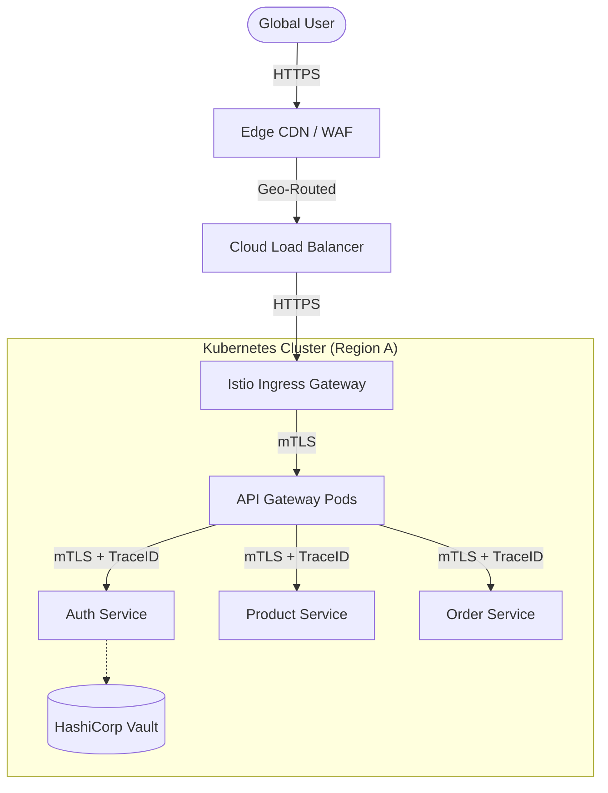
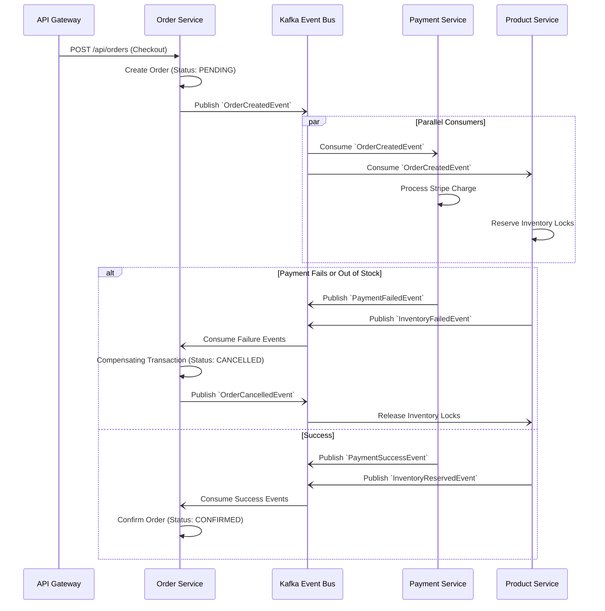
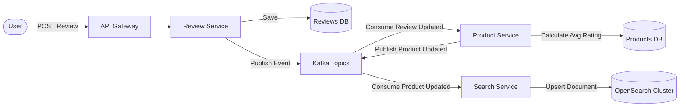

# Enterprise Microservice Communication Diagrams

The following Mermaid diagrams illustrate the highly resilient, planet-scale communication patterns between the microservices.

## 1. Global Ingress & API Gateway Flow (Synchronous)

This diagram highlights the Edge CDN, Web Application Firewall, and Istio Service Mesh routing.

## 2. Distributed Saga Orchestration (Asynchronous)

This diagram illustrates a planet-scale Checkout Saga utilizing Apache Kafka (replacing RabbitMQ for extreme throughput) and Dead Letter Queues (DLQ).

## 3. Read-Heavy CQRS & Search Cascade

This diagram demonstrates how product reviews trigger an eventually-consistent recalculation of average ratings, syncing straight to the distributed OpenSearch cluster.

