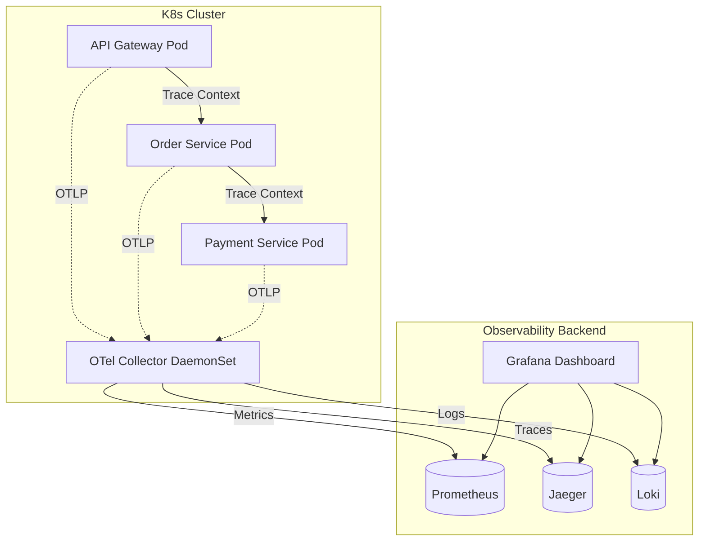

# Planet-Scale Observability Architecture

This document details the transition from basic console logging to a robust, unified Observability stack based on OpenTelemetry (OTel).

## 1. The Three Pillars of Observability

To achieve true enterprise observability, we must correlate metrics, logs, and traces.

### 1.1 Distributed Tracing (Jaeger / Tempo)
**Implementation Goal**: Follow a single user request (e.g., Checkout) as it hops across 5 different microservices and the event bus.
- **W3C Trace Context**: The API Gateway will generate a unique `traceparent` HTTP header.
- **Propagation**: Every internal `fetch()` call and RabbitMQ/Kafka message MUST carry this `traceparent`.
- **Instrumentation**: We will inject `@opentelemetry/auto-instrumentations-node` into every microservice Docker container.

### 1.2 Centralized Logging (Loki / ELK)
**Implementation Goal**: Never SSH into a container to read logs. 
- **Format**: All `console.log` statements will be replaced with structured JSON logging (using `winston` or `pino`).
- **Correlation**: Every log entry will automatically include the `traceId` and `spanId` injected by OpenTelemetry.
- **Aggregation**: A FluentBit DaemonSet deployed to the Kubernetes cluster will scrape all stdout JSON logs and forward them to a central Grafana Loki cluster.

### 1.3 Advanced Metrics (Prometheus / Grafana)
**Implementation Goal**: Proactively alert on Service Level Objective (SLO) breaches.
- **Custom Metrics**: Beyond standard CPU/RAM, we will track business metrics: "Active Carts", "Payment Failures/sec", "Pending Approvals Queue Size".
- **Dashboards**: Grafana will connect to Prometheus (metrics), Loki (logs), and Jaeger (traces), providing a single pane of glass for SREs.

## 2. Telemetry Flow Diagram

