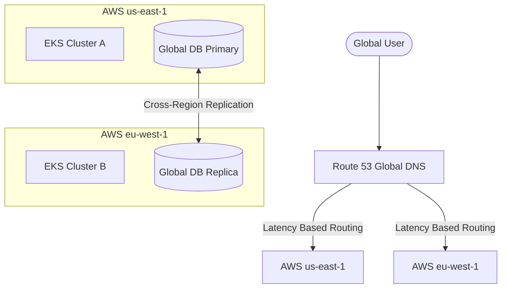

# Cloud Native Kubernetes Production Design

To achieve 99.99% global uptime, local Docker Compose is insufficient. We are migrating to a multi-region, enterprise-grade Kubernetes deployment.

## 1. Kubernetes Infrastructure strategy

- **Cluster Engines**: Amazon EKS or Google GKE.
- **Infrastructure as Code (IaC)**: Provisioned entirely via Terraform.
- **Release Strategy**: GitOps using ArgoCD to sync GitHub repository manifests directly to the clusters.

## 2. Multi-Region Deployment Design

To survive an entire cloud region failure (e.g., us-east-1 goes down), we employ an Active-Active global architecture.

## 3. Deployment Artifact Structure

### 3.1 Terraform Modules (`terraform/`)
- `vpc/`: Defines subnets, NAT gateways, and routing tables.
- `eks/`: Provisions the Kubernetes control plane and worker node groups.
- `rds/`: Provisions CockroachDB/Aurora clusters.

### 3.2 Helm Charts (`helm/ecommerce-platform/`)
Instead of duplicate YAML manifests, we use Helm templates.
- `values-staging.yaml`
- `values-production.yaml`

### 3.3 Blue-Green Deployment Model
To ensure zero-downtime releases, we utilize Argo Rollouts.
1. Deploy `v2` pods alongside `v1` pods (Green environment).
2. Run automated integration tests against the Green environment.
3. If tests pass, Istio instantly flips 100% of ingress traffic from `v1` to `v2`.
4. If errors spike, Istio automatically rolls back to `v1`.

## 4. Kubernetes Autoscaling
- **HPA (Horizontal Pod Autoscaler)**: Automatically spins up new API Gateway and Order Service pods when CPU > 70% or active HTTP requests spike during flash sales.
- **Karpenter / Cluster Autoscaler**: Automatically provisions new EC2/GCE worker nodes when pods are in a "Pending" state due to insufficient cluster capacity.
