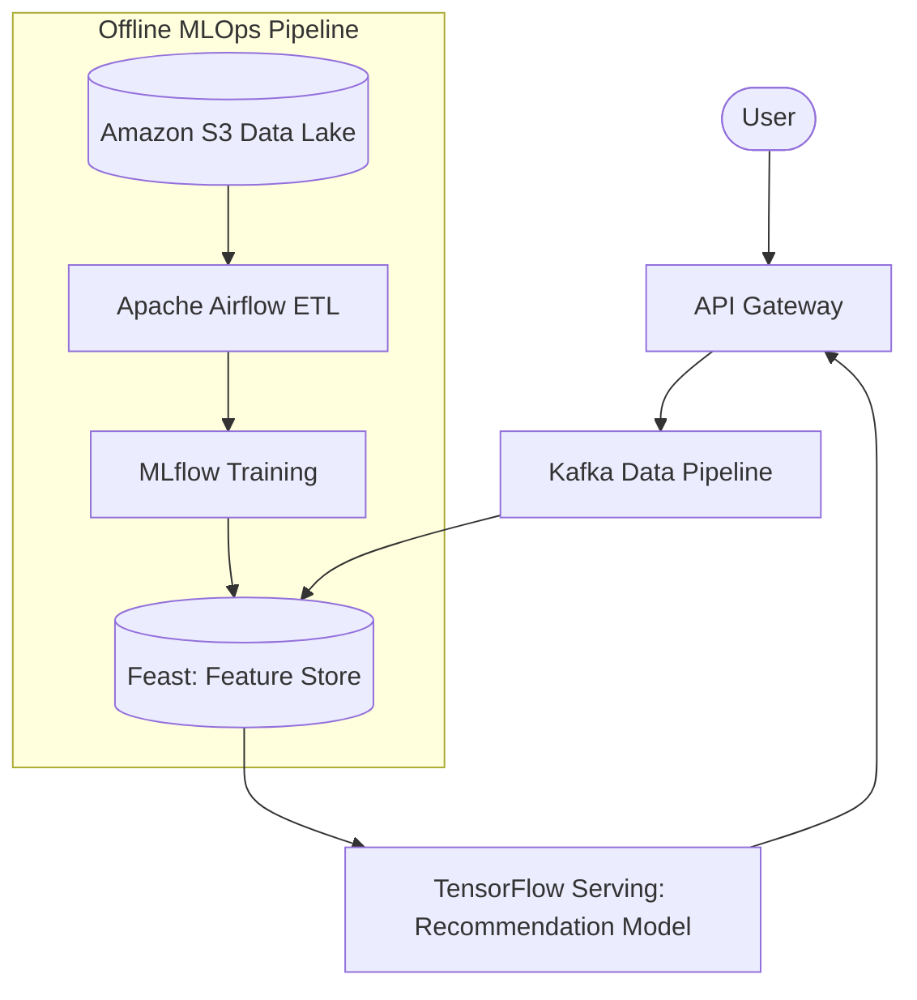

# Advanced AI & Machine Learning Architecture

The current platform utilizes a primitive `ai-service` containing hardcoded responses or basic LLM wrappers. To transform into an AI-driven global marketplace, we must adopt a comprehensive MLOps architecture.

## 1. Recommendation Engine (Collaborative Filtering)

To drive conversion rates, the platform needs personalized product recommendations.

## 2. Business Intelligence & Fraud Detection

- **Demand Forecasting**: Analyzes past order volumes via Google BigQuery / AWS Redshift to predict supply chain shortages and adjust dynamic pricing automatically.
- **Fraud Detection AI**: Evaluates real-time checkout payloads against an XGBoost model. If the transaction scores `> 0.85` anomaly probability, it requires mandatory 2FA or manual human review before charging Stripe.

## 3. MLOps Pipeline
- **Model Versioning**: Managed via MLflow.
- **Model Deployment**: Champion/Challenger (A/B testing) deployment strategy. The `ai-service` will route 10% of users to the Challenger model and measure checkout conversion rates to determine if the new model performs better.
