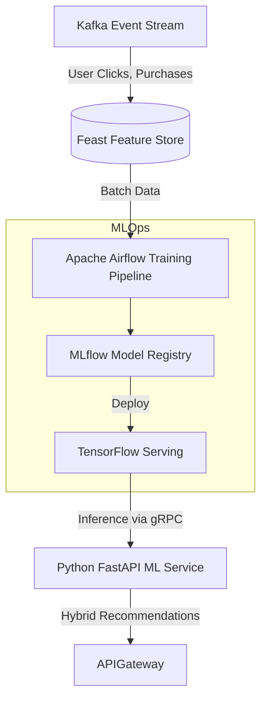
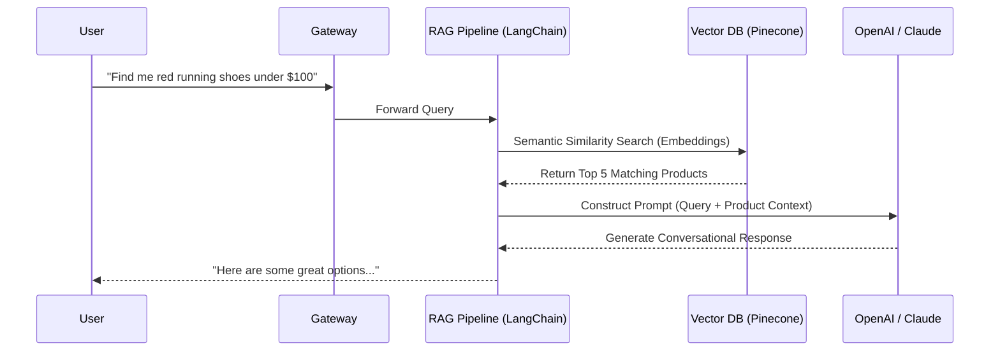

# AI Commerce Engine & MLOps System

This document outlines the architecture for transforming the platform into an intelligent, data-driven ecosystem using Python-based ML microservices.

## 1. AI/ML System Design (Recommendation & Operations)

We utilize a comprehensive MLOps pipeline to handle model training, versioning, and real-time inference.

### 1.1 Hybrid Recommendation Engine
- **Collaborative Filtering**: Recommends products based on similar users' purchasing habits (Matrix Factorization).
- **Content-Based Filtering**: Suggests visually or textually similar products using NLP (TF-IDF/BERT) and Computer Vision embeddings.

### 1.2 AI Operations
- **Demand Forecasting**: Time-series models (Prophet/ARIMA) predict inventory depletion rates.
- **Dynamic Pricing**: Reinforcement learning adjusts prices dynamically based on competitor data, stock levels, and real-time demand.

## 2. LLM Chatbot Architecture (AI Shopping Assistant)

The AI Shopping Assistant utilizes a Retrieval-Augmented Generation (RAG) architecture to prevent hallucinations and provide accurate product data.

