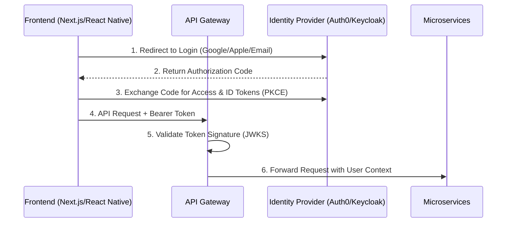
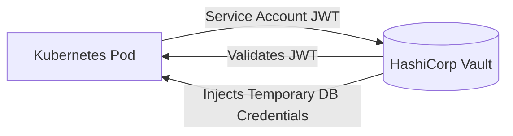

# Enterprise Zero-Trust Security Architecture

This document defines the Zero-Trust network topologies, advanced authentication strategies, and secret management protocols necessary to achieve PCI-DSS and GDPR compliance.

## 1. OAuth2 / OIDC Integration Flow

We migrate from a simple local JWT strategy to an enterprise Identity Provider (IdP) model using OAuth2/OIDC (e.g., Keycloak, Auth0, or Okta).

## 2. HashiCorp Vault Secret Management

Environment variables (`.env`) are strictly forbidden in the production Enterprise deployment. All secrets, database credentials, and TLS certificates are managed dynamically.

- **Dynamic Secrets**: Vault generates temporary, short-lived MongoDB credentials for the `product-service`. If compromised, the credentials expire automatically within 1 hour.
- **Encryption as a Service (EaaS)**: Sensitive PII (Personally Identifiable Information) is sent to Vault's Transit Engine for encryption *before* being stored in the database.

## 3. Web Application Firewall (WAF) & Protection

- **Bot Detection**: Cloudflare Bot Management analyzes behavioral patterns and issues CAPTCHAs to suspected automated scripts scraping product prices.
- **Rate Limiting Intelligence**: Instead of blocking purely by IP, the WAF limits requests based on authenticated User IDs and ASN reputation to prevent distributed volumetric attacks.

## 4. Compliance Controls (PCI-DSS & GDPR)
- **PCI-DSS**: No PAN (Primary Account Number) data ever touches our servers. Stripe Elements tokenizes card details directly on the client device.
- **GDPR**: "Right to be Forgotten" endpoints are implemented to cascade user deletion events via Kafka, purging PII across all databases automatically.
